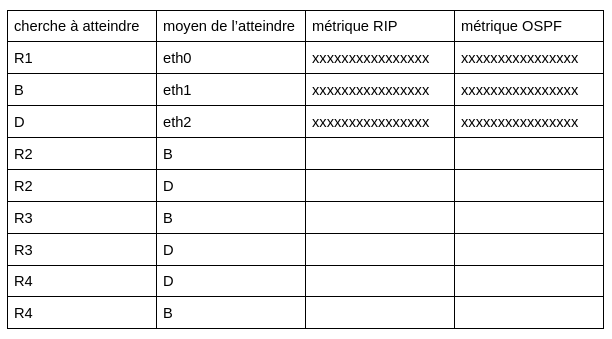
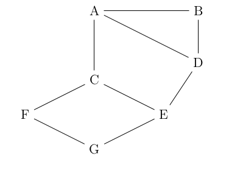

### exercice 11.1

Le réseau schématisé ci-dessous est constitué de 4 réseaux locaux (switch+ordinateurs) : R1, R2, R3 et R4, et de 4 routeurs A, B, C et D.

On donne les débits (bandes passantes) de la connexion entre chaque routeur :
A-B : 100 Mbps
A-D : 1000 Mbps
B-C : 10 Mbps
C-D : 10 Mbps
On propose ci-dessous une table de routage pour le routeur A :

1) Complétez la colonne “métrique RIP” du tableau ci-dessus.

2) Complétez la colonne “métrique OSPF” du tableau ci-dessus. 

3) Un ordinateur appartenant au réseau local R1 envoie un paquet de données à un ordinateur appartenant au réseau local R2.

a) Donnez le chemin suivi par ce paquet de données si le routeur A utilise le protocole de routage RIP. Justifiez votre réponse.
	
b) Donnez le chemin suivi par ce paquet de données si le routeur A utilise le protocole de routage OSPF. Justifiez votre réponse.
	
4) Le routeur D est en panne. Un ordinateur appartenant au réseau local R1 envoie un paquet de données à un ordinateur appartenant au réseau local R3. Donnez le chemin suivi par ce paquet de données si le routeur A utilise le protocole de routage OSPF. Justifiez votre réponse.

5) La liaison entre 2 routeurs a un coût de 0,2, calculez le débit de cette liaison en bps puis en Mbps.

### exercice 11.2
Cet exercice est tiré du sujet 0 du bac NSI.

On considère un réseau composé de plusieurs routeurs reliés de la façon suivante :

#### Le protocole RIP

Le protocole RIP permet de construire les tables de routage des différents routeurs, en indiquant pour chaque
routeur la distance, en nombre de sauts, qui le sépare d’un autre routeur. Pour le réseau ci-dessus, on dispose
des tables de routage suivantes :

Question 1

1) Le routeur A doit transmettre un message au routeur G, en effectuant un nombre minimal de
sauts. Déterminer le trajet parcouru.

2) Déterminer une table de routage possible pour le routeur G obtenu à l’aide du protocole RIP.

Question 2

Le routeur C tombe en panne. Reconstruire la table de routage du routeur A en suivant le
protocole RIP.

#### Le protocole OSPF

Contrairement au protocole RIP, l’objectif n’est plus de minimiser le nombre de routeurs traversés par un
paquet. La notion de distance utilisée dans le protocole OSPF est uniquement liée aux coûts des liaisons.
L’objectif est alors de minimiser la somme des coûts des liaisons traversées.

On a rajouté sur le graphe représentant le réseau précédent les différents débits des liaisons.
On rappelle que 1 Gb/s = 1 000 Mb/s = 10 9 bits/s.

Question 3

1) Vérifier que le coût de la liaison entre les routeurs A et B est 0,01.

2) La liaison entre le routeur B et D a un coût de 5. Quel est le débit de cette liaison ?

Question 4 

Le routeur A doit transmettre un message au routeur G, en empruntant le chemin dont la somme
des coûts sera la plus petite possible. Déterminer le chemin parcouru. On indiquera le raisonnement
utilisé.