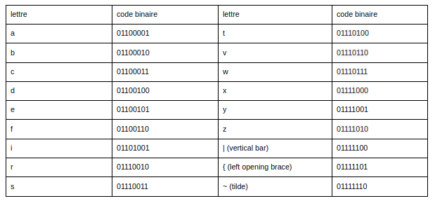

### exercice 12.1

1) Après un chiffrement symétrique on obtient la message suivant : ri. Sachant que la clé de chiffrement est : 00001010 (la clé est directement donnée en binaire), déterminez le message d’origine.

On donne l’extrait de la table ASCII suivant :

      

2) Un utilisateur B souhaite échanger un message chiffré avec un utilisateur A en utilisant un chiffrement asymétrique. A possède une clé publique (AKpub) et une clé privée (AKpriv). B possède une clé publique (BKpub) et une clé privée (BKpriv). B souhaite chiffrer un message m afin de pouvoir l’envoyer à A  :

a) Quelle clé va être utilisée par B pour chiffrer le message m ?

Qb) uelle clé va être utilisée par A pour déchiffrer le message m ?

3) Expliquez en  quelques  lignes le principe du protocole HTTPS (on s’intéressera uniquement à l’aspect Sécurité du protocole)

 