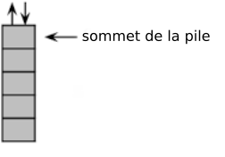
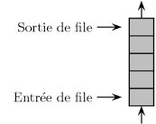
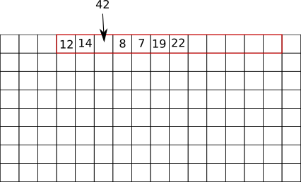

## 1) introduction
De nombreux algorithmes "classiques" manipulent des structures de données plus complexes que des simples nombres (nous aurons l'occasion d'en voir plusieurs cette année). Nous allons ici voir quelques-unes de ces structures de données. Nous allons commencer par des types de structures relativement simples : les listes, les piles et les files. Ces trois types de structures sont qualifiés de linéaires.
## 2) les listes
Une liste est une structure de données permettant de regrouper des données. Une liste L est composée de 2 parties : sa tête (souvent noté car), qui correspond au dernier élément ajouté à la liste, et sa queue (souvent noté cdr) qui correspond au reste de la liste. Le langage de programmation Lisp (inventé par John McCarthy en 1958) a été un des premiers langages de programmation à introduire cette notion de liste (Lisp signifie "list processing"). Voici les opérations qui peuvent être effectuées sur une liste :

- obtenir une liste vide (vide)
- tester si une liste est vide (estVide)
- obtenir le dernier élément ajouté à la liste (car)
- obtenir une liste contenant tous les éléments d'une liste à l'exception du dernier élément ajouté (cdr)
- construire une liste à partir d'un élément et d'un autre liste (cons)

Une liste vide est très souvent représentée par nil.

Exemples : (**les  exemples suivants s'enchainent**) 

L = vide() => permet d'obtenir une liste vide notée L

estVide(L) => renvoie True

L1 = cons(12, L) =>  permet d'obtenir une liste L1 qui contient le nombre 12

estVide(L1) => renvoie False

L1 = cons(15, L1) => désormais la liste L1 contient les nombres 15 et 12

il est possible d'enchainer les "cons" : L1 = cons(1, cons(11, L1)) => permet d'obtenir un liste L1 qui contient désormais les nombres 1, 11, 15 et 12

car(L1) renvoie 1, la liste L1 reste inchangée

L2 = cdr(L1) =>  la liste L2 contient 11,15 et 12 (la liste L1 reste inchangée)

## 3) les  piles
On retrouve dans les piles une partie des propriétés vues sur les listes. Dans les piles, il est uniquement possible de manipuler le dernier élément introduit dans la pile. On prend souvent l'analogie avec une pile d'assiettes : dans une pile d'assiettes la seule assiette directement accessible et la dernière assiette qui a été déposée sur la pile.

Les piles sont basées sur le principe LIFO (Last In First Out : le dernier rentré sera le premier à sortir). On retrouve souvent ce principe LIFO en informatique.

Voici les opérations que l'on peut réaliser sur une pile :

- on peut savoir si une pile est vide (estVide)
- on peut empiler un nouvel élément sur la pile (piler en français, push en anglais)
- on peut récupérer l'élément au sommet de la pile tout en le supprimant. On dit que l'on dépile (dépiler en français, pop en anglais)
- on peut connaitre le nombre d'éléments présents dans la pile (taille)

Exemples :

Soit une pile P composée des éléments suivants : 12, 14, 8, 7, 19 et 22 (le sommet de la pile est 22) **Pour chaque exemple ci-dessous on repart de la pile d'origine** :

- pop(P) renvoie 22 et la pile P est maintenant composée des éléments suivants : 12, 14, 8, 7 et 19 (le sommet de la pile est 19)
- push(P,42) la pile P est maintenant composée des éléments suivants : 12, 14, 8, 7, 19, 22 et 42  (le sommet de la pile est 42)
- si on applique pop(P) 6 fois de suite, estVide(P) renvoie vrai
- après avoir appliqué pop(P) une fois, taille(P) renvoie 5

## 4)  les  files
Comme les piles, les files ont des points communs avec les listes. Différences majeures : dans une file on ajoute des éléments à une extrémité de la file et on supprime des éléments à l'autre extrémité. On prend souvent l'analogie de la file d'attente devant un magasin pour décrire une file de données.

 

Les files sont basées sur le principe FIFO (First In First Out : le premier qui est rentré sera le premier à sortir. Ici aussi, on retrouve souvent ce principe FIFO en informatique.

Voici les opérations que l'on peut réaliser sur une file :

- on peut savoir si une file est vide (estVide)
- on peut ajouter un nouvel élément à la file (enfiler en français, enqueue en anglais)
- on peut récupérer l'élément situé en bout de file tout en le supprimant (défiler en français, dequeue en anglais)
- on peut connaitre le nombre d'éléments présents dans la file (taille)

Exemples :

Soit une file F composée des éléments suivants : 12, 14, 8, 7, 19 et 22 (le premier élément rentré dans la file est 22 ; le dernier élément rentré dans la file est 12). **Pour chaque exemple ci-dessous on repart de la file d'origine** :

- enqueue(F,42) la file F est maintenant composée des éléments suivants : 42, 12, 14, 8, 7, 19 et 22 (le premier élément rentré dans la file est 22 ; le dernier élément rentré dans la file est 42)
dequeue(F) la file F est maintenant composée des éléments suivants : 12, 14, 8, 7, et 19 (le premier élément rentré dans la file est 19 ; le dernier élément rentré dans la file est 12)
- si on applique dequeue(F) 6 fois de suite, estVide(F) renvoie vrai
- après avoir appliqué dequeue(F) une fois, taille(F) renvoie 5.

## 5) Types abstraits et représentation concrète des données

Nous avons évoqué ci-dessus la manipulation des types de données (liste, pile et file) par des algorithmes, mais, au-delà de la beauté intellectuelle de réfléchir sur ces algorithmes, le but de l'opération est souvent, à un moment ou un autre, de "traduire" ces algorithmes dans un langage compréhensible pour un ordinateur (Python, Java, C,...). On dit alors que l'on implémente un algorithme. Il est donc aussi nécessaire d'implémenter les types de données comme les listes, les piles ou les files afin qu'ils soient utilisables par les ordinateurs. Les listes, les piles ou les files sont des "vues de l'esprit" présent uniquement dans la tête des informaticiens, on dit que ce sont des types abstraits de données (ou plus simplement des types abstraits). L'implémentation de ces types abstrait, afin qu'ils soient utilisables par une machine, est loin d'être une chose triviale. L'implémentation d'un type de données dépend du langage de programmation. Il faut, quel que soit le langage utilisé, que le programmeur retrouve les fonctions qui ont été définies pour le type abstrait (pour les listes, les piles et les files cela correspond aux fonctions définies ci-dessus). Certains types abstraits ne sont pas forcément implémentés dans un langage donné, si le programmeur veut utiliser ce type abstrait, il faudra qu'il le programme par lui-même en utilisant les "outils" fournis par son langage de programmation.

Pour implémenter les listes (ou les piles et les files), beaucoup de langages de programmation utilisent 2 structures : les tableaux et les listes chaînées.

Un tableau est une suite contiguë de cases mémoires (les adresses des cases mémoire se suivent) :

 

Le système réserve une plage d'adresse mémoire afin de stocker des éléments.

 

La taille d'un tableau est fixe : une fois que l'on a défini le nombre d'éléments que le tableau peut accueillir, il n'est pas possible modifier sa taille. Si l'on veut insérer une donnée, on doit créer un nouveau tableau plus grand et déplacer les éléments du premier tableau vers le second tout en ajoutant la donnée au bon endroit !

Dans certains langages de programmation, on trouve une version "évoluée" des tableaux : les tableaux dynamiques. Les tableaux dynamiques ont une taille qui peut varier. Il est donc relativement simple d'insérer des éléments dans le tableau. Ce type de tableaux permet d'implémenter facilement le type abstrait liste (de même pour les piles et les files).

À noter que les "listes Python" (listes Python) sont des tableaux dynamiques. Attention de ne pas confondre avec le type abstrait liste défini ci-dessus, ce sont de "faux amis".

tableau dynamique :

Autre type de structure que l'on rencontre souvent et qui permet d'implémenter les listes, les piles et les files : les listes chaînées.

Dans une liste chaînée, à chaque élément de la liste on associe 2 cases mémoire : la première case contient l'élément et la deuxième contient l'adresse mémoire de l'élément suivant.

 

Il est relativement facile d'insérer un élément dans une liste chaînée :

 

Il est aussi possible d'implémenter les types abstraits en utilisant des structures plus complexes que les tableaux et les listes chaînées (nous  verrons des exemples en Python dans les activités).
