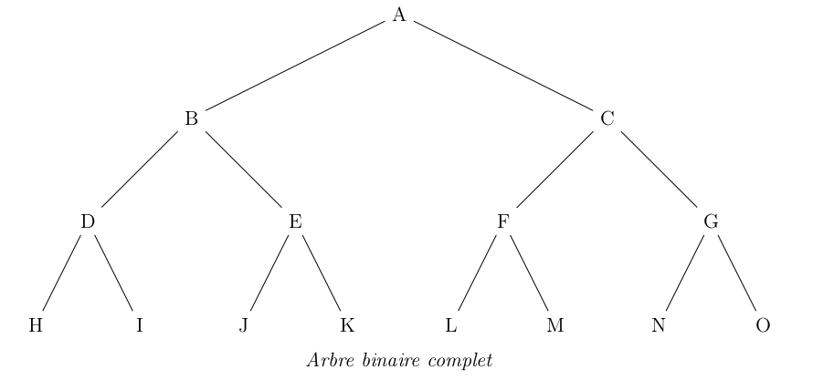

### exercice 8.1

Soit l’arbre binaire A suivant :

1) A propos de l’arbre A :

- Déterminez la profondeur du noeud 6
- Déterminez la hauteur de l’arbre

2) Parcourir l’arbre A dans l’ordre suffixe 

3)

- Expliquez pourquoi l’arbre binaire A n’est pas un arbre binaire de recherche
- Modifiez l’arbre binaire A pour qu’il devienne un arbre binaire de recherche (on gardera les mêmes noeuds). On appellera l’arbre binaire obtenu “arbre B”

4) Parcourir l’arbre B dans l’ordre infixe

### exercice 8.2
Cet exercice est tiré du sujet 0 du bac NSI.

Dans cet exercice, on utilisera la convention suivante : la hauteur d’un arbre binaire ne comportant qu’un
nœud est 1.

#### Question 1

Déterminer la taille et la hauteur de l’arbre binaire suivant :

#### Question 2

On décide de numéroter en binaire les nœuds d’un arbre binaire de la façon suivante :
- la racine correspond à 1 ;
- la numérotation pour un fils gauche s’obtient en ajoutant le chiffre 0 à droite au numéro de son
père ;
- la numérotation pour un fils droit s’obtient en ajoutant le chiffre 1 à droite au numéro de son
père;

Par exemple, dans l’arbre ci-dessous, on a utilisé ce procédé pour numéroter les nœuds A, B, C, E et
F .

1) Dans l’exemple précédent, quel est le numéro en binaire associé au nœud G ?

2) Quel est le nœud dont le numéro en binaire vaut 13 en décimal ?

3) En notant h la hauteur de l’arbre, sur combien de bits seront numérotés les nœuds les plus en
bas ?

4) Justifier que pour tout arbre de hauteur h et de taille n ≥ 2, on a :

h ≤ n ≤  2h − 1

#### Question 3

Un arbre binaire est dit complet si tous les niveaux de l’arbre sont remplis.

On décide de représenter un arbre binaire complet par un tableau de taille n + 1, où n est la taille de l’arbre, de la façon suivante :
- La racine a pour indice 1 ;
- Le fils gauche du nœud d’indice i a pour indice 2 × i ;
- Le fils droit du nœud d’indice i a pour indice 2 × i + 1 ;
- On place la taille n de l’arbre dans la case d’indice 0.

1. Déterminer le tableau qui représente l’arbre binaire complet de l’exemple précédent.
2. On considère le père du nœud d’indice i avec i ≥ 2. Quel est son indice dans le tableau ?

#### Question 4 
On se place dans le cas particulier d’un arbre binaire de recherche complet où les nœuds
contiennent des entiers et pour lequel la valeur de chaque noeud est supérieure à celles des
noeuds de son fils gauche, et inférieure à celles des noeuds de son fils droit.

Écrire une fonction recherche ayant pour paramètres un arbre arbre et un élément element. Cette
fonction renvoie True si element est dans l’arbre et False sinon. L’arbre sera représenté par un tableau comme dans la question précédente.