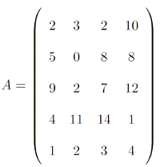
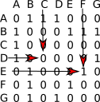

## 1) introduction

Imaginez un réseau social ayant 6 abonnés (A, B, C, D, E et F) où :

- A est ami avec B, C et D
- B est ami avec A et D
- C est ami avec A, E et D
- D est ami avec tous les autres abonnés
- E est ami avec C, D et F
- F est ami avec E et D

La description de ce réseau social, malgré son faible nombre d'abonnés, est déjà quelque peu rébarbative, alors imaginez cette même description avec un réseau social comportant des millions d'abonnés !

Il existe un moyen plus "visuel" pour représenter ce réseau social : on peut représenter chaque abonné par un cercle (avec le nom de l'abonné situé dans le cercle) et chaque relation "X est ami avec Y" par un segment de droite reliant X et Y ("X est ami avec Y" et "Y est ami avec X" étant représenté par le même segment de droite).

Voici ce que cela donne avec le réseau social décrit ci-dessus :


## 2) notion de graphes

Ce genre de figure s'appelle un graphe. Les graphes sont des objets mathématiques très utilisés, notamment en informatique. Les cercles sont appelés des sommets et les segments de droites qui relient 2 sommets des arêtes.

Plus formellement on dira qu'un graphe G est un couple G = (V,E) avec V un ensemble de sommets et E un ensemble d'arêtes.

Autre utilisation possible des graphes : les logiciels de cartographie (ces logiciels sont souvent utilisés couplés à des récepteurs GPS). Ces logiciels de cartographie permettant, connaissant votre position grâce à un récepteur GPS, d'indiquer la route à suivre pour se rendre à endroit B. Comment modéliser l'ensemble des lieux et des routes ? Simplement à l'aide d'un graphe ! Chaque lieu est un sommet et les routes qui relient les lieux entre eux sont des arêtes.

Soit les lieux suivants : A, B, C, D, E, F et G.

Les différents lieux sont reliés par les routes suivantes :

- il existe une route entre A et C
- il existe une route entre A et B
- il existe une route entre A et D
- il existe une route entre B et F
- il existe une route entre B et E
- il existe une route entre B et G
- il existe une route entre D et G
- il existe une route entre E et F

Ici aussi, la représentation sous forme de graphe s'impose :


Problème : avec cette représentation du réseau routier sous forme de graphe, il est impossible de tenir compte des routes en sens unique (par exemple il est possible d'aller de A vers D mais pas de D vers A)

Voici de nouvelles contraintes :

- il existe une route entre A et C (double sens)
- il existe une route entre A et B (sens unique B->A)
- il existe une route entre A et D (sens unique A->D)
- il existe une route entre B et F (sens unique B->F)
- il existe une route entre B et E (sens unique E->B)
- il existe une route entre B et G (double sens)
- il existe une route entre D et G (double sens)
- il existe une route entre E et F (double)

Pour tenir compte de ces nouvelles contraintes, on utilisera un graphe orienté :


Dans un graphe orienté, les arêtes possèdent une orientation. Ces "arêtes orientées" sont souvent appelées "arcs". On dira qu'un graphe orienté G est un couple G = (V,A) avec V un ensemble de sommets et A un ensemble d'arcs.

Parfois il est intéressant d'associer aux arrêtes ou aux arcs des valeurs, on parle alors de graphes pondérés. Si nous revenons à notre "graphe cartographie", il est possible d'associer à chaque arête la distance en Km entre les 2 lieux :


Il est aussi possible d'associer à chaque arête la durée du trajet entre 2 points :


En fonction du choix fait par le conducteur (trajet le plus court "en distance" ou trajet le plus court "en temps"), l'algorithme permettant de déterminer le "chemin le plus court entre 2 points" travaillera sur le graphe "graphe pondéré (Km) cartographie" ou sur le graphe "graphe pondéré (minutes) cartographie". À noter que le "graphe pondéré (minutes) cartographie" peut évoluer au cours du temps en fonction du trafic routier : une application comme Waze utilise les données en en provenance des utilisateurs de l'application afin de mettre à jour en temps réel leur "graphe pondéré (minutes) cartographie".

Pour terminer avec ces généralités sur les graphes, voici 2 définitions qui nous seront utiles par la suite :

- Une chaine est une suite d'arêtes consécutives dans un graphe, un peu comme si on se promenait sur le graphe. On la désigne par les lettres des sommets qu'elle comporte.
- Un cycle est une chaine qui commence et se termine au même sommet.

## 3) implémentation des graphes

Il existe deux méthodes permettant d'implémenter un graphe : les matrices d'adjacences et les listes d'adjacences.

### a) implémentation d'un graphe à l'aide d'une matrice d'adjacence

Une matrice est un tableau à double entrée :



La matrice A ci-dessus est constitué de 5 lignes et 4 colonnes. On appelle matrice carrée une matrice qui comporte le même nombre de lignes et de colonnes. Les matrices d'adjacences sont des matrices carrées.

Reprenons l'exemple du "graphe cartographie" :


Voici la matrice d'adjacence de ce graphe :


Comment construire une matrice d'adjacence ?

Il faut savoir qu'à chaque ligne correspond un sommet du graphe et qu'à chaque colonne correspond aussi un sommet du graphe. À chaque intersection ligne i-colonne j (ligne i correspond au sommet i et colonne j correspond au sommet j), on place un 1 s'il existe une arête entre le sommet i et le sommet j, et un zéro s'il n'existe pas d'arête entre le sommet i et le sommet j.



- Il existe une arête entre le sommet E et le sommet F, nous avons donc placé un 1 à l'intersection de la ligne E et de la colonne F (il en est de même à l'intersection de la ligne F et de la colonne E)
- Il n'existe pas d'arête entre le sommet D et le sommet C, nous avons donc placé un 0 à l'intersection de la ligne D et de la colonne C (il en est de même à l'intersection de la ligne C et de la colonne D)

Il est aussi possible d'établir une matrice d'adjacence pour un graphe orienté. Le principe reste le même : si le sommet i (ligne) est lié au sommet j (colonne), nous avons un 1 à l'intersection (0 dans le cas contraire).


Il est aussi possible d'utiliser une matrice d'adjacence pour implémenter un graphe pondéré : on remplace les 1 par les valeurs liées à chaque arc.


Il est assez simple d'utiliser les matrices d'adjacence en Python grâce aux tableaux de tableaux vus l'année dernière :

```
#matrice d'ajacence
m = [[0, 1, 1, 1, 0, 0, 0],
     [1, 0, 0, 0, 1, 1, 1],
     [1, 0, 0, 0, 0, 0, 0],
     [1, 0, 0, 0, 0, 0, 1],
     [0, 1, 0, 0, 0, 1, 0],
     [0, 1, 0, 0, 1, 0, 0],
     [0, 1, 0, 1, 0, 0, 0]]

```
### b) implémentation d'un graphe à l'aide de listes d'adjacence

Pour commencer, on définit une liste des sommets du graphe. À chaque élément de cette liste, on associe une autre liste qui contient les sommets lié à cet élément :

Reprenons l'exemple du "graphe cartographie" :


Voici la liste d'adjacence de ce graphe :


Pour les graphes orientés, il est nécessaire de définir 2 listes : la liste des successeurs et la liste des prédécesseurs. Soit un arc allant d'un sommet A vers un sommet B (flèche de A vers B). On dira que B est un successeur de A et que A est un prédécesseur de B.


liste d'adjacence successeurs du graphe orienté cartographie :


liste d'adjacence prédécesseurs du graphe orienté cartographie :


Il est possible de travailler avec des listes d'adjacences en Python en utilisant les dictionnaires :

```
#liste d'ajacence
l = {'A':('B','C','D'), 'B':('A', 'E', 'F', 'G'), 'C':('A'), 'D':('A', 'G'), 'E':('B', 'F'), 'F':('B', 'E'), 'G':('B', 'D')}
```
### c) matrice d'adjacence ou liste d'adjacence ?

Comment choisir l'implémentation à utiliser (matrice d'adjacence ou liste d'adjacence) ?

- le choix se fait en fonction de la densité du graphe, c'est-à-dire du rapport entre le nombre d'arêtes et le nombre de sommets. Pour un graphe dense on utilisera plutôt une matrice d'adjacence.
- certains algorithmes travaillent plutôt avec les listes d'adjacences alors que d'autres travaillent plutôt avec les matrices d'adjacences. Le choix doit donc aussi dépendre des algorithmes utilisés (nous aurons très prochainement l'occasion d'étudier plusieurs de ces algorithmes).
